Career is called *Vocation* too — from the Latin **vocare**, "to call." In a way engineering has been my calling since childhood: solving puzzles, building LEGO cars, and using old toy motors to craft fans on hot summer days. Eventually years later , I did designed and drove my own car, ventured into wind power, but ultimately, the puzzles kept pulling me back. That led me to become an Energy Systems engineer , arguably the most complex (and exciting) puzzle I've encountered on which I continoue to work. Here's my engineering journey: from universities to the projects I've built and the impact I've made.

## Professional Journey




I joined the Secure Power Business Unit at Schneider Electric to drive innovation through **Energy Spine**, a landmark program aimed at redefining electrical architecture for next-generation data centers.
My journey progressed across three key dimensions: **Architecture Design** (control strategies for DC UPS and battery systems), **Software-Defined Power** (CI/CD pipelines, hardware-agnostic development, and HIL validation), and **Advanced Applications** (as an Electrifier Program expert, leveraging cooling flexibility for AI load optimization).

Key achievements include: 

- Architecting next‑generation **800V DC microgrid and DC UPS** solutions for future data centers, translating customer requirements into end‑to‑end system architectures and technical specifications — securing **€50M in R&D funding**.
- Designed and implemented **CI/CD pipelines** (GitHub Actions, Docker, RaaS) and a scalable verification and validation framework for **200K+ LOC** projects, cutting PLC code generation and validation time by up to **80%**.
- Led **Hardware‑in‑the‑Loop (HIL)** validation framework development on Speedgoat real‑time hardware — timing analysis, fault injection, and requirements‑based verification — while training cross‑functional teams on HIL methodology.
- Developed **AI‑driven load smoothing** algorithms for DC UPS systems, enabling ancillary services (FCR, FRR) and reducing peak demand by **18%**.
- Advancing control strategies for Liquid Cooling systems to optimize thermal inertia for enhanced power quality — an Electrifier Project initiative validated through rigorous validation protocols.

  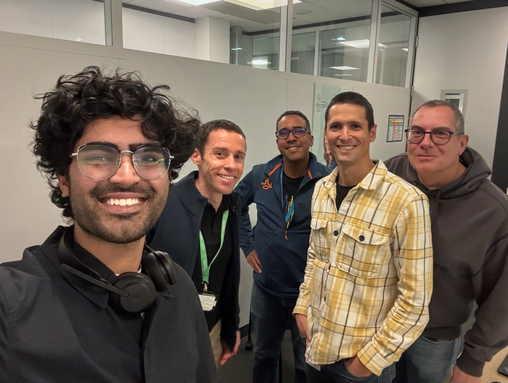
  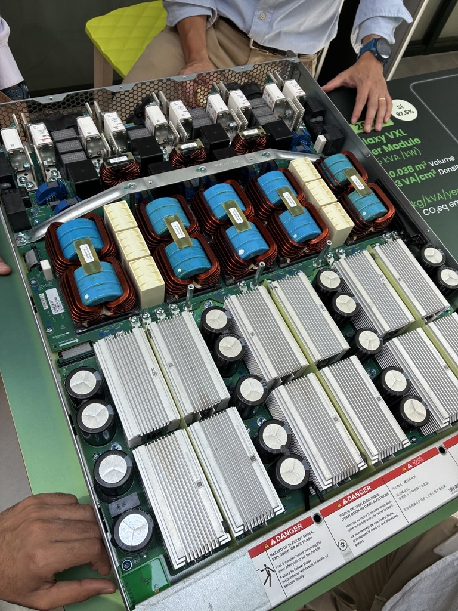




At the AI Hub, I focused on optimizing bidirectional Electric Vehicle charging in microgrids. This role involved developing and validating machine learning and optimization models, with Model Predictive Control (MPC) selected as the primary approach. I collaborated with the Sustainability Research Institute on technical and market analysis.

Key achievements include:

- Designed and deployed Model Predictive Control (MPC) algorithms in MATLAB/Simulink for bidirectional EV charging, achieving **85% faster simulation speed** and **99.8% real‑time accuracy**.
- Designed battery degradation models leveraging weighted Ah‑throughput methodology, extending lifespan by **2+ years** in Vehicle‑to‑Building applications.
- Developed and implemented stochastic optimization framework to predict EV usage patterns under variable constraints, reducing emissions and operational costs by **up to 60%**.
- Perfoeld studies with Sustainability Research Institute on energy market modeling, quantifying **20–30% residential energy savings** and authoring research papers that informed internal and external policy decisions.

Download the Detailed Report here : 

[📄 Download: Bidirectional EV MCP Research](AshirEVBidirSchneiderElectric.pdf)

  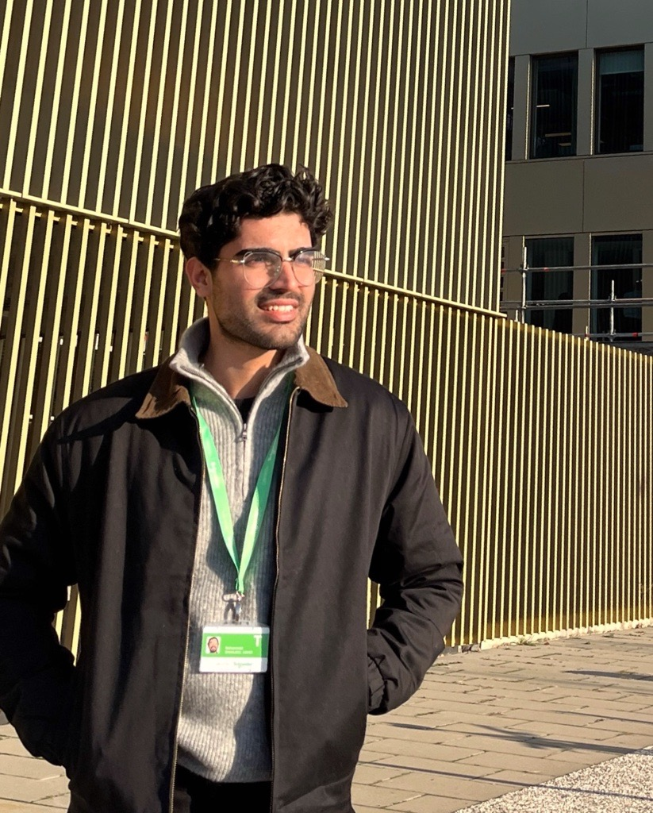
  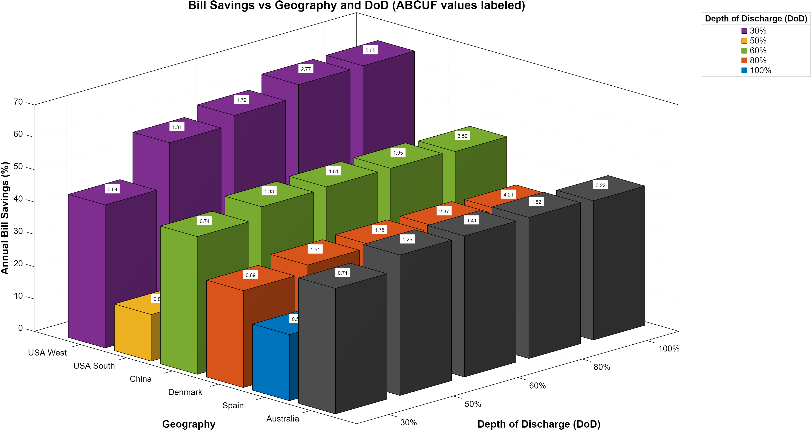




At the intersection of K State and Black & Veatch, I contributed to advancing second-life EV battery applications in microgrids through:

- Developed comprehensive test protocols for second‑life EV battery systems in microgrid applications, achieving **UL1974 certification** and supporting 3 operational pilot projects.
- Designed a two‑stage battery management system that demonstrated measurable efficiency gains in field validation.
-Implemented an ML-based Arc Fault Detection model on STM32 microcontrollers, validated at **98.5% accuracy** with sub-2ms inference latency, meeting safety-critical timing requirements.

  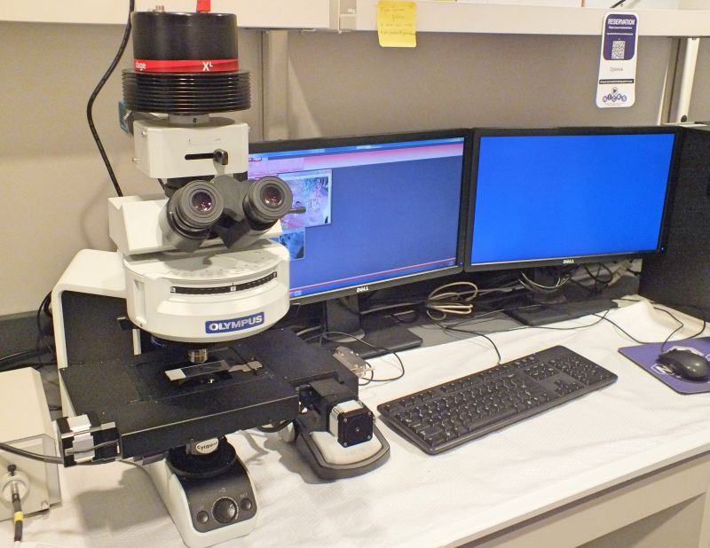
  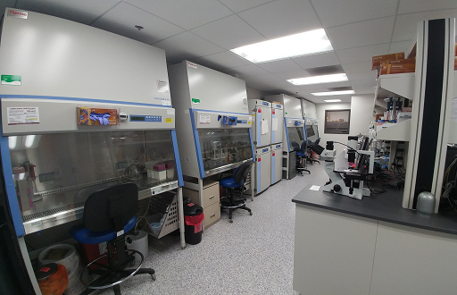




First experince in a mega plant , I got to learn the ropes of onfield enginnering , mainteannce and proactive problem solving . The Fertilizer plant is a liefline of Paksitan's agricultural sector and have consistently been among the safest plant in the country . I got to study it and also bring new things to the table . Some highlishts include : 

- Assisted in Design and deployment grid‑connected solar microgrid providing carbon‑free electricity to 2,400 residents, implementing real‑time monitoring
and developing heuristic controller software for automation of storage and discharge.
- Developed machine learning models to estimate Scope 3 supplier emissions using supplier and CDP data, covering 95% of GHG inventory gaps.

  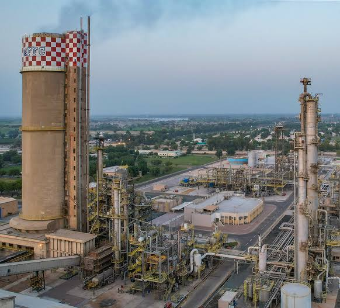
  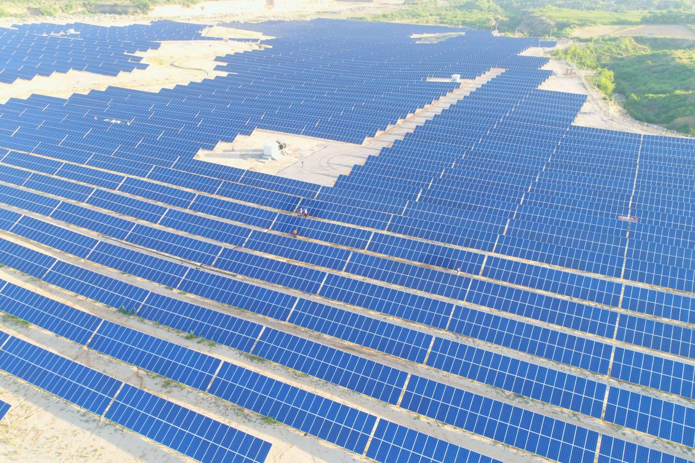




At this student-led energy technology startup in Pakistan's premier Science and Technology Park, I led the technical design of an innovative vibrational harvesting device that converts walking into electrical power. This role provided invaluable exposure to the full product lifecycle—from technical design and engineering leadership to manufacturing feasibility, cost optimization, and market strategy. I learned that great engineering isn't just about what *can* be done, but what *should* be done. Here are my key contributions: 

- Architected mechanical and electrical systems for piezoelectric micro-generators, converting kinetic motion into electrical output for lighting and auxiliary applications.
- Designed and validated prototypes through iterative testing and demonstration, securing 3 million in seed funding from venture investors.
- Developed CAD-optimized designs for cost-effective manufacturing and scalable deployment across three pilot installation sites in the capital region.

  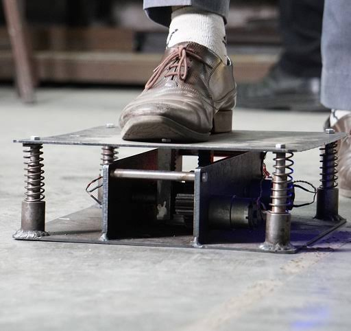
  





*Photos from each chapter of the journey are coming soon.*

## Education

**Masters In Energy Systems** — **IMT Atlantique (École Des Mines)**  
Nantes, France  || *Sept 2023 – Sept 2025* · CGPA 3.85/4.00  
One of only 2 recipients of the France Excellence for Climate Change Scholarship from Pakistan , an opportunity I'm still thrilled about ! This allowed me to dive into IMT Atlantique's rigorous, well-rounded program.  
Beyond the technical deep dives into energy markets, economics, predictive modeling, optimization, chemical process electrification, and environmental analysis.The real magic was connecting with brilliant minds from across the globe, building friendships, and gaining fresh perspectives that fundamentally shaped my engineering and personal outlook on life. 
 

  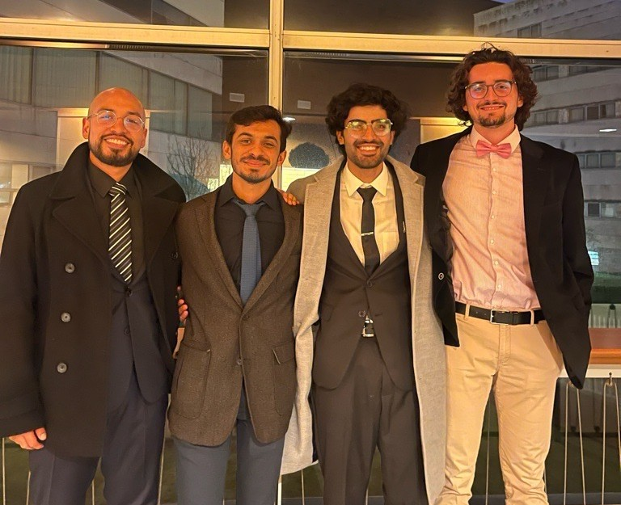
  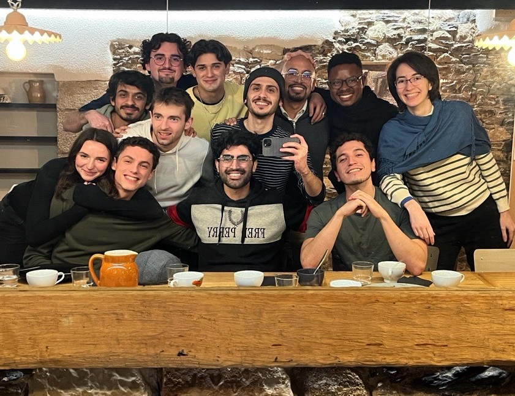

**Bachelors In Engineering** — **Kansas State University (K State)**  
Manhattan, United States  || *May 2022 – Aug 2023* · CGPA 4.00/4.00 (Dean's List Recipient)  
Awarded a USEFP scholarship from Pakistan, I studied and represented my country in the United States. Kansas turned out to be a hidden gem in the Midwest! I dove deep into electrical vehicles and battery systems, and was part of the BAJA team.   
On the side, I explored philosophy through courses and events and represented K-State's debate team across North America—ultimately reaching the finals of the North American BP Debates in Seattle in 2022.

  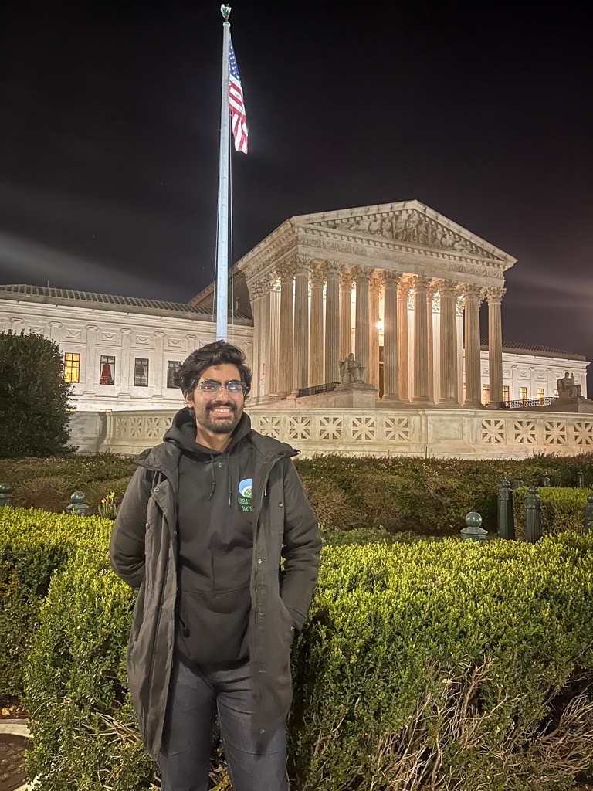
  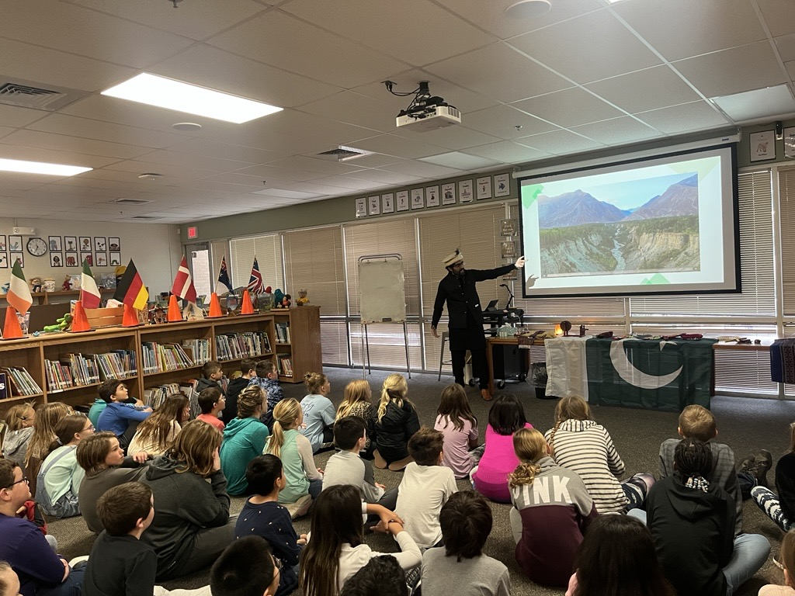

**Bachelors In Mechanical Engineering** — **National University of Sciences and Technology (NUST)**  
Islamabad, Pakistan  || *Aug 2019 – April 2022* · CGPA 3.94/4.00 ( Double Gold Medal)  
Getting into NUST was a watershed moment , it felt like winning the lottery in the small town of mine! Suddenly I was surrounded by some of the sharpest minds I've encountered anywhere (and I've travelled quite a bit by now). The energy, ambition, and intellectual rigor were intoxicating.  
Against all odds, I managed to top my batch , earning one Gold Medal for that achievement , and the faculty voted me the best graduate of the year, a distinction that came with another Gold Medal and a commemorative pen. Still surreal, honestly. 

  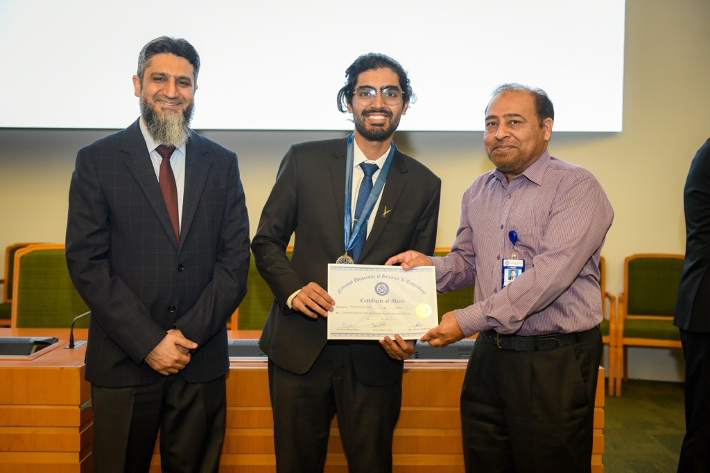
  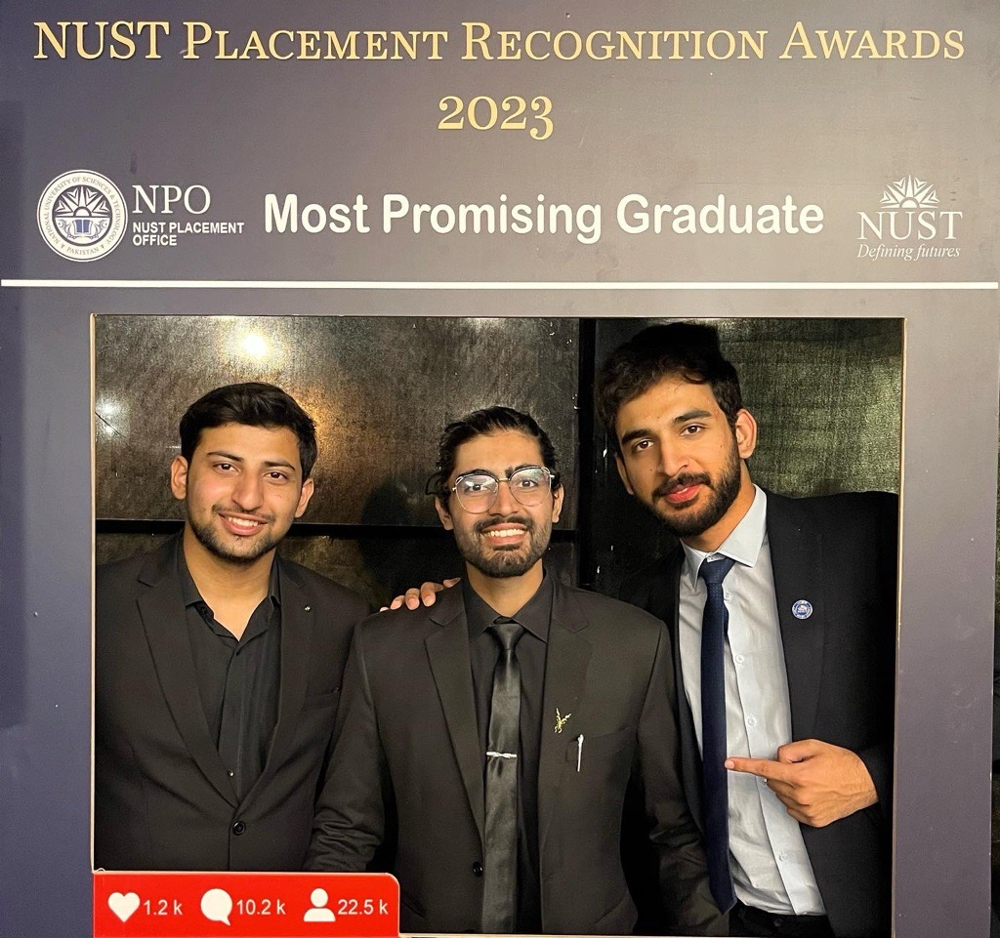

## Core Skills

| Category | Skills |
|---|---|
| **Controls & Simulation** | Electrical & physical modelling, digital twin, SCADA, industrial networking, PLC codegen, SIL/HIL/MIL testing |
| **Energy Systems** | Power management, DC UPS, cooling systems, battery systems (BESS), microgrid design & optimization |
| **Programming & Tools** | Python, MATLAB/Simulink, C++, GitHub Actions, Docker, CI/CD pipelines, Machine Learning (OpenCV, PyTorch) |
| **Project Management** | Agile methodologies, JAMA/JIRA requirements tracking, market research, scenario modelling |
| **Languages** | English (C2, bilingual), French (B2, intermediate) |

## Certifications

- Data Centers Specialization
- GitHub Actions Specialization
- Stanford Machine Learning Certification

## Projects

A closer look at some of the systems and models built along the way:
